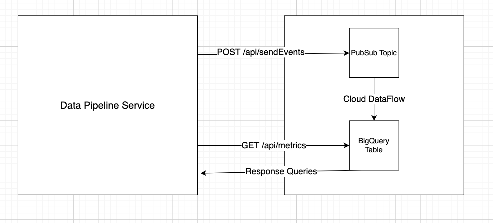

# Nodejs DataPipeline 

The main purpose of this repository is to showcase a Data pipeline project that accepts mobile application events and send the information to a Google PubSub topic.
When system publish a message to PubSub topic, a DataFlow job in GCP takes the message and sends it to Big Query table. Users can get daily statistics using 
api/getMetrics endpoint.





## Example request-response for POST /api/sendEvents

### Request
```
{
"type": "event",
"session_id": "9FDA74C2-AB57-4840-87D0-64324772B5T2", "event_name": "click",
"event_time": 1654804327,
"page": "main",
"country": "TR",
"region": "Marmara",
"city": "Istanbul",
"user_id": "selin"
}
```
### Response
```
{
    "success": true,
    "message": "Message 4720481643586628 published."
}
````
## Example response from GET /api/metrics
```
{
    "result": "Success",
    "daily_stats": [
        {
            "date": "12.06.2022",
            "active_user_count": 0,
            "average_session_duration": null,
            "new_user_count": 0
        },
        {
            "date": "11.06.2022",
            "active_user_count": 1,
            "average_session_duration": 0,
            "new_user_count": 1
        },
        {
            "date": "10.06.2022",
            "active_user_count": 1,
            "average_session_duration": 0,
            "new_user_count": 1
        }
    ]
}
```

# Environment vars
This project uses the following environment variables:

| Name                          | Description                         | Default Value                                  |
| ----------------------------- | ------------------------------------| -----------------------------------------------|
|NODE_ENV           | Node environment           | "dev"      |
|GOOGLE_APPLICATION_CREDENTIALS           | PubSub and BigQuery Clients uses as file path for auth.json           | "./auth.json"      |
|GOOGLE_CLOUD_PROJECT | Google Cloud Project Name | "code***-{numbers}
|PUBSUB_TOPIC| PubSub Topic Name | eventTopic
|BQ_TABLENAME | BigQuery Table Name | {projectName}.{datasetName}.{tableName}
|EXPRESS_PORT | Express server port | 3000
|AUTH_TOKEN| Authentication token for testing purposes| {jwtToken}


# Pre-requisites
- Install [Node.js](https://nodejs.org/en/) version 16.14.0


# Getting started
- Clone the repository
```
git clone https://github.com/root999/DataPipeline
```
- Install dependencies
```
cd DataPipeline
npm install
```
- Build and run the project 
```
npm start
```
  Navigate to `http://localhost:3000`
  
- Optionally, If you have docker installed, you can use 
```
cd DataPipeline
docker-compose up
```
## Couple things to point out

The project structured based on NodeJS best practices guides. I tried to make a central error handling mechanism to handle errors and created a BaseError class that can help developers to examine bugs in the code. The errors basically divided into two different modules, Operational Errors and Programmers Errors. Operational Errors are happens when user make a mistake like sending an empty body. These errors are handled in central error handling mechanism and treated as not required to restart the system. Programmer's errors are basically bugs and require immediate exit from the project and restart. Central error handling mechanism checks if an error is operational or not and decides whether it should restart or not.

## Project Structure
The folder structure of this app is explained below:

| Name | Description |
| ------------------------ | --------------------------------------------------------------------------------------------- |
| **app**         | Contains project source codes                                                    |
| **app/node_modules**        | Contains all npm modules |
| **app/logs**      | Contains logs in the project. If project deployed using docker-compose, it automatically syncs with the folder inside docker container|
| **app/metrics**              | Contains route, controller and test implementations of metrics endpoint.|  
| **app/pipeline**      | Contains route, controller and test implementations of data pipeline endpoint.|
| **app/utils**           | Contains BigQuery and PubSub helper functions as well as error-handling and logging functions and tests.|                       
| **config.js**           | Manages environment variables centerally. |
| **index.js**      | Entry point to express app |                                                   |
| package.json             | Contains npm dependencies as well as build scripts | 
| eslintrc.js              | Config settings for ESLint code style checking                                                |
|.env| Contains environment variables|
|Dockerfile | Docker container building script|
|docker-compose.yml|Docker compose configuration yml|

### Running the build
All the different build steps are orchestrated via [npm scripts](https://docs.npmjs.com/misc/scripts).
Npm scripts basically allow us to call (and chain) terminal commands via npm.


| Npm Script | Description |
| ------------------------- | ------------------------------------------------------------------------------------------------- |
| `start`                   | Starts the node server     |
| `start:dev`                   | Starts the node server using nodemon   |
| `test`                    | Runs build and run tests using Jest  and returns coverage     |


## Testing
The tests are  written in Jest. endpoint tests are written using supertest

```
"jest": "^28.1.1",
"supertest": "^6.2.3",
```

### Example index.test.js
```
const request = require('supertest');
const app = require('./index');
const config = require('./config');
describe('Should throws an error ', () => {
  test('when user tries to connect without permission', async () => {
    const res = await request(app)
      .get('/')
      .send();
    expect(401);
    expect(res.error.text).toEqual('invalid token...');
  });
  test('returns Error when authenticated user attempts to use invalid enpoint ', async () => {
    const res = await request(app)
      .get('/s')
      .auth(config.authToken.token, { type: 'bearer' })
      .send();
    expect(404);
  });
});

```
### Running tests using NPM Scripts
````
npm test  

````
